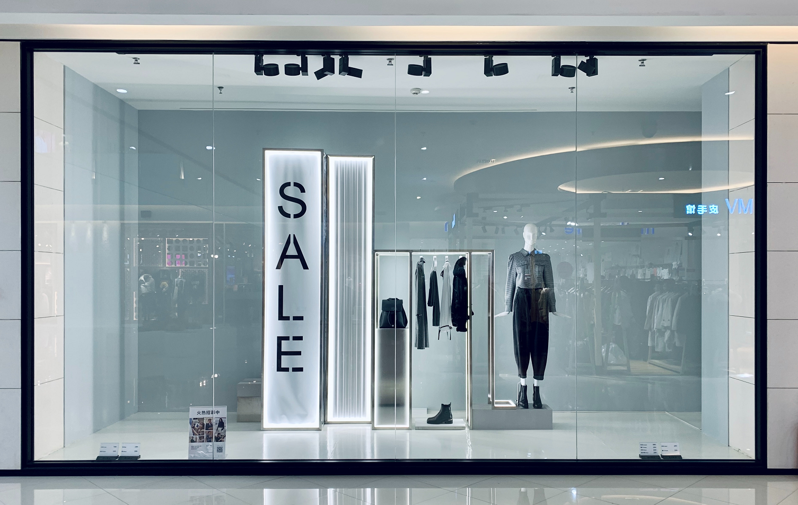
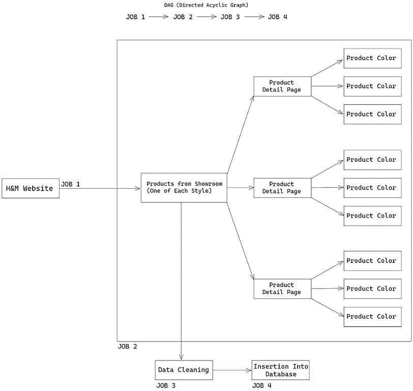
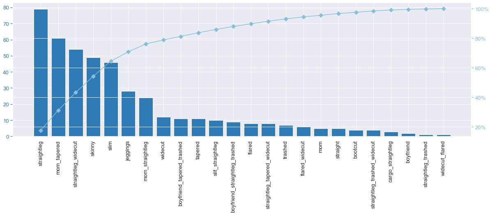
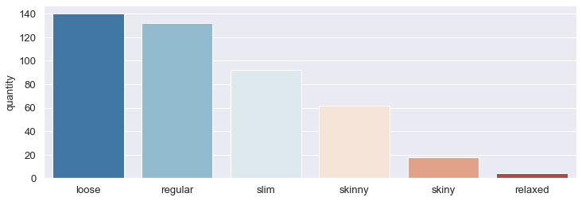
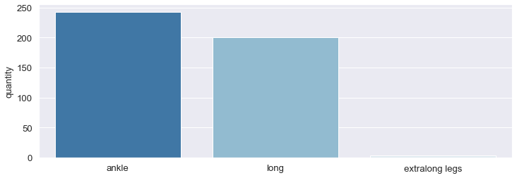
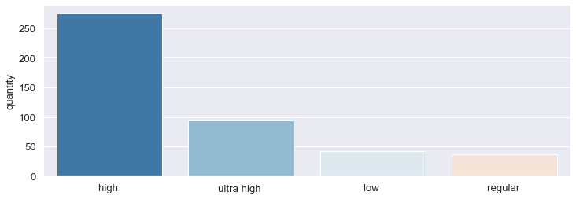
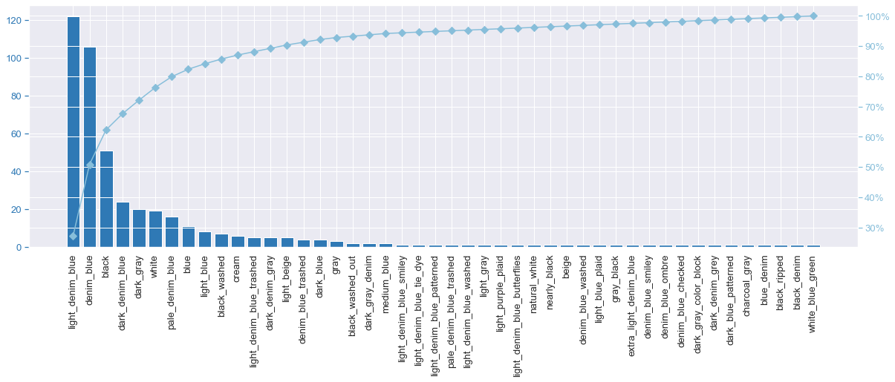
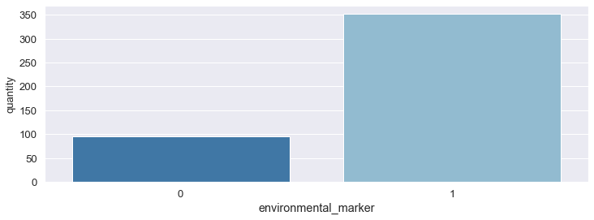

# Scraping and Analysis of Fashion Trends and Pricing

  

Watching how the business competitors adjust to market changes, bring innovation, and formulate strategies helps companies thrive in the market. Competitive analytics helps e-commerce companies to keep an eye on market trends, benchmark against their closest competitors, determine pricing trends, discover ways to innovate, and identify market gaps among many others.

Things are always dynamic in the e-commerce industry. For this, they need effective strategies to conduct competitor analysis. One way to conduct a competitive analysis of e-commerce sites is through web scraping. Web scraping retrieves the HTML code from the web page that contains data of interest and transmits it to databases, and then performs the analysis.  

## Business Problem
Mariana and Laura are friends and business partners. After several successful businesses, they are planning to enter the US fashion market as an e-commerce business model. 

The initial idea is to enter the market with only one product and for a specific public, i,n this case the product would be jeans for the female public. The goal is to keep the cost of operation low and scale up as they get customers. However, even with the entrance product and the audience defined, the partners have no experience in this fashion market and therefore do not know how to define basic things like price, the type of jeans, and the main materials to manufacture each piece.

So the partners hired a Data Science consultancy to answer the following questions: 
1. What would be the medium sales ticket of the products? 
2. What are the types of jeans and their colors for the initial products? 
3. What are the product's compositions?

The main competitors in the business are H&M and Macy's.

## Solution Strategy
1. Business understanding
2. ETL architeture design (extract, transfor and load)
3. Web scraping (extract)
4. Data cleaning (transfor)
5. Save data into database (load)
6. Data analysis
7. Delivery of the answers and insights via report

## Assumptions
* This is a fictional problem in order to show knowledge in data engineering and data analysis. Since it is not a real problem, only one of the main business competitors was considered, keeping in mind that in a real problem more than one competitor should be considered. 
* Most of the missing data corresponding to the style and fit variables were filled in with searches based on the product name that include product characteristics. 

 By understanding the business, and analyzing the data available for scrapping, these were the features created from the web scrapping and its definitions. 

| Feature              | Definition                                                                               |
|:---------------------|:-----------------------------------------------------------------------------------------|
| product_id           | Unique product identification number composed by the junction of style_id and color_id.  |
| price                | Product sales price.                                                                     |
| name                 | Product name.                                                                            |
| color_id             | Indetification number for the product color.                                             |
| color_name           | Name of the product color.                                                               |
| style_id             | Identification number of the product style.                                              |
| style                | Description of the product style                                                         |
| length               | Description of the product length.                                                       |
| waist                | Description of the product waist height.                                                 | 
| fit                  | Description of the fit of the product on the body.                                       |
| environmental_marker | Whether the product is part of the environmental market (1) or not (0).                  |
| cotton               | The percentage of cotton in the product.                                                 |
| spandex              | The percentage of spandex in the product.                                                |
| polyester            | The percentage of polyesterin the product.                                               |
| elastomultiester	   | The percentage of elastomultiester in the product.                                       |
| modal                | The percentage of modal in the product.                                                  |
| rayon                | The percentage of rayon in the product.                                                  |
| copolyester          | The percentage of copolyester in the product.                                            |
| elastodiene          | The percentage of elastodiene in the product.                                            |
| lyocell              | The percentage of lyocell in the product.                                                |
| other_fibres         | The percentage of other fibres in the product.                                           |
| scrapy_datetime      | Date time identifying when the web scrapping was done.                                   |

## ETL Architeture

  

## Business Results
The medium price of the competitor's products is 29.99 USD. 75% of the products in the dataset are between 17.99 USD and 34.99 USD.

Pareto diagram was used to define which are the most significant styles and colors, i.e. those that represent 80% of the number of products in the dataset, and that according to Pareto reserve around 20% of the available styles and colors.

Of the 24 styles present in the dataset, 8 represent 80% of the products in the dataset: straightleg, tapered mom, straightleg widecut, skinny, slim, jeggings, mom straightleg, and widecut. In terms of length and waist, the ankle and long lengths represent practically 100% of the products, and 82.37% have either a high or ultra high waist. About the fit, 80% of the products have fit loose, regular, or slim. I recommend starting with products following the styles, fit, length and waist described here, and as you gain market share expand to others.

  

    

Of the 46 colors available 7 represent 80% of the products in the dataset: light denim blue, denim blue, black, dark denim blue, white, and pale denim blue. I recommend starting with these colors for the products, and as you gain market share expand the colors.

 

It is already well-known that the main material of jeans is cotton. Jeans that are not 100% cotton are most often also made of spandex and polyester. As already commented, products with polyester have a negative relationship with price. This makes sense because polyester is not considered a noble textile material. 

Almost 80% of products have some percentage of material that is considered environmentally responsible. Without question I recommend that you have products with environmentally responsible materials in your product portfolio.

 
  
## Conclusion
Scraping data for analysis brought valuable insights for a company that is starting up that needs to focus on products that are in high demand and are competitively priced, to position itself ahead of competitors. The biggest discovery was undoubtedly the percentage of products in the environmental market for current companies, which is almost 80%. 

Since the percentage of products in the environmental market is so high, the next step would be to understand the environmental market and collect data about market.

## References
Python from DS to DEV on [Comunidade DS](https://www.comunidadedatascience.com).     
Introduction Image by [卓倩 李](https://unsplash.com/@unrivaledmarijuana?utm_source=unsplash&utm_medium=referral&utm_content=creditCopyText) on [Unsplash](unsplash.com/?utm_source=unsplash&utm_medium=referral&utm_content=creditCopyText).
